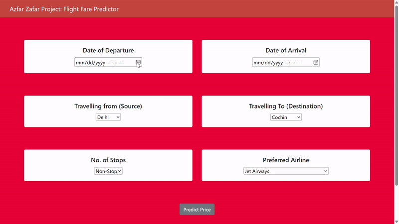

# Flight-Fare-Predictor
* Flight fare prediction involves building models based on historical time-dependent data points to make predictions through extrapolation.
  - Google Flights is a popular example of a flight fare predictor that can predict future flight prices based on past trends.
* This Python Flight Fare Predictor app is deployed using Flask and will return the predicted price based on inputs from the user such as:
  - Departure date & time
  - Arrival date & time
  - Origin 
  - Destination
  - Layovers
  - Air carrier
* This project required an ample amount of feature engineering and data preprocessing as the independent features are categorical, hence OneHotEncoding and LabelEncoder were used to convert these independent features to numerical values.
## App Demo

